# Question 0

Using python, try to clean/aggregate the data inside of grid_weather_data.csv in order to avoid NaN.


```python
import pandas as pds
import seaborn as sns
import numpy as np
from dateutil.parser import parse

raw_data = pds.read_csv('grid_weather_data.csv')

#insert datetime object creating time order
raw_data['datetime'] = pds.to_datetime(raw_data['date']) + pds.TimedeltaIndex(raw_data['hour'], unit='H')

#rename or remove axis
raw_data.drop(columns=['Unnamed: 0', 'date', 'hour'], inplace=True)
raw_data.rename(columns={'id':'station_id'}, inplace=True)

#raw_data.set_index('date_time', inplace=True)
print(raw_data['station_id'].unique())

#raw_data.head()
```

    [59999 60020 60046]


As três chaves estrangeiras no arquivo .csv indicam três fontes para esse conjunto.
Melhor separar cada dado por fonte e tentar olhar alguma estrutura na distruicao dos Nan's para cada fonte.
Uma mascara zero-um pode informar algum padrão.


```python
station1 = raw_data[raw_data['station_id'] == 59999].set_index('datetime')
zerone_mask1 = station1.isna()*1
sns.heatmap(zerone_mask1, cmap="Blues",
            cbar_kws={'label': 'Nan mask | 1=Nan; 0=Valor Valido'})
zerone_mask1.mean()
```


    station_id               0.000000
    precipitation            0.654642
    dry_bulb_temperature     0.102768
    wet_bulb_temperature     0.106787
    high_temperature         0.679640
    low_temperature          0.653877
    relative_humidity        0.101428
    relative_humidity_avg    0.723010
    pressure                 0.087506
    sea_pressure             0.592278
    wind_direction           0.126857
    wind_speed_avg           0.700643
    cloud_cover              0.671004
    evaporation              0.087530
    dtype: float64


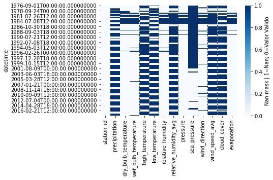


```python
start_date = '2012-03-30'
end_date   = '2012-04-10'

sns.heatmap(zerone_mask1[start_date : end_date], cmap="Blues")
```


    <matplotlib.axes._subplots.AxesSubplot at 0x7fa0aebdd320>


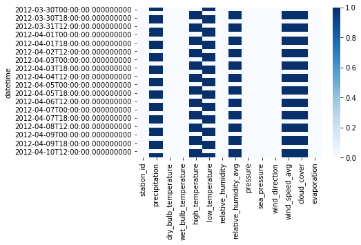


O Heatmap de todos os dados da primeira fonte (estação 59999) permite ver que a distribuicao de Nan's não é igual para todos as variáveis. Os dados são obtidos três vezes ao dia.

Olhando de perto, podemos ver que temos um padrão para algumas váriaveis. São dois Nan's e um dado válido por dia.


```python
station2 = raw_data[raw_data['station_id'] == 60020].set_index('datetime')
zerone_mask2 = station2.isna()*1
sns.heatmap(zerone_mask2, cmap="Blues",
            cbar_kws={'label': 'Nan mask | 1=Nan; 0=Valor Valido'})
zerone_mask2.mean()
```


    station_id               0.000000
    precipitation            0.649192
    dry_bulb_temperature     0.031466
    wet_bulb_temperature     0.094626
    high_temperature         0.662525
    low_temperature          0.691127
    relative_humidity        0.038679
    relative_humidity_avg    0.676620
    pressure                 0.107423
    sea_pressure             0.709261
    wind_direction           0.053577
    wind_speed_avg           0.733432
    cloud_cover              0.715401
    evaporation              0.054628
    dtype: float64


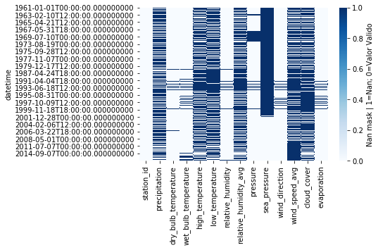


```python
start_date = '2012-03-30'
end_date   = '2012-04-15'

sns.heatmap(zerone_mask2[start_date : end_date], cmap="Blues")
```


    <matplotlib.axes._subplots.AxesSubplot at 0x7fa0aa275400>


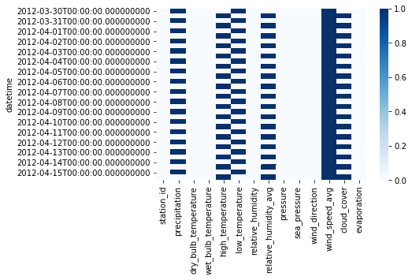


A segunda fonte (estacao 60020) possui frequência de medição diária. Os Nan's aparecem alternadamente entre os dias para algumas variáveis.


```python
station3 = raw_data[raw_data['station_id'] == 60046].set_index('datetime')
zerone_mask3 = station3.isna()*1
sns.heatmap(zerone_mask3, cmap="Blues",
            cbar_kws={'label': 'Nan mask | 1=Nan; 0=Valor Valido'})
zerone_mask3.mean()
```


    station_id               0.000000
    precipitation            0.711413
    dry_bulb_temperature     0.005706
    wet_bulb_temperature     0.295970
    high_temperature         0.742378
    low_temperature          0.711772
    relative_humidity        0.140902
    relative_humidity_avg    0.745531
    pressure                 0.423344
    sea_pressure             0.426576
    wind_direction           0.136512
    wind_speed_avg           0.714645
    cloud_cover              0.730846
    evaporation              0.159178
    dtype: float64


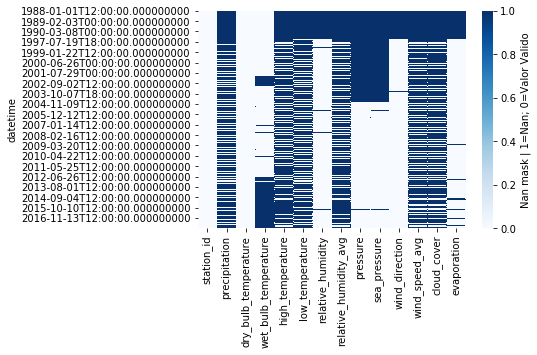


```python
start_date = '2012-03-30'
end_date   = '2012-04-10'

sns.heatmap(zerone_mask3[start_date : end_date], cmap="Blues")
```


    <matplotlib.axes._subplots.AxesSubplot at 0x7fa0aa1cea20>


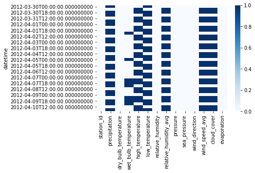


A terceira fonte (estação 60046) é um caso parecido com a primeira. Frequência de medições de 8 horas. Dois Nan's para cada dado válido.

Para eliminar os Nan's,  evitando perder muitos dados, vamos tranformar os dados de frequência de 8 horas, em dados diários (e se for o caso interpolar). E o dado diário vamos interpolar linearmente para retirar os Nan's. O intervalo espacial será mantido para cada fonte.  


```python
#reamostragens interpolacoes e processamentos
new_station1=station1.resample('D').mean()
new_station1.interpolate(inplace=True)
new_station1['station_id'] = new_station1['station_id'].astype(int)
new_station1['datetime'] = pds.to_datetime(new_station1.index)

new_station3=station3.resample('D').mean()
new_station3.interpolate(inplace=True)
new_station3['station_id'] = new_station3['station_id'].astype(int)
new_station3['datetime'] = pds.to_datetime(new_station3.index)

new_station2=station2.interpolate()
new_station2['station_id'] = new_station2['station_id'].astype(int)
new_station2['datetime'] = pds.to_datetime(new_station2.index)
```


```python
import matplotlib.pyplot as plt

cols_plot = ['dry_bulb_temperature', 'relative_humidity', 'wind_speed_avg']
units_plot = ['temp (C)', 'humidade. (%)', 'int. vento (km/h)']

fig = plt.figure()
axes = station1['2010':][cols_plot].plot(marker='.', linestyle='None', figsize=(11, 9), subplots=True)
for i, ax in enumerate(axes):
    new_station1['2010':].plot(y=cols_plot[i], alpha=0.7, color="red", lw='0.6', ax=ax)
    ax.set_ylabel(units_plot[i])
    ax.legend(["original", "processado"]);
r = plt.suptitle("Estação 59999 | dados brutos vs processados", y=0.92)

fig = plt.figure()
axes = station2['2010':][cols_plot].plot(marker='.', linestyle='None', figsize=(11, 9), subplots=True)
for i, ax in enumerate(axes):
    new_station2['2010':].plot(y=cols_plot[i], alpha=0.7, color="red", lw='0.6', ax=ax)
    ax.set_ylabel(units_plot[i])
    ax.legend(["original", "processado"]);
r = plt.suptitle("Estação 60020 | dados brutos vs processados", y=0.92)

fig = plt.figure()
axes = station3['2010':][cols_plot].plot(marker='.', linestyle='None', figsize=(11, 9), subplots=True)
for i, ax in enumerate(axes):
    new_station3['2010':].plot(y=cols_plot[i], alpha=0.7, color="red", lw='0.6', ax=ax)
    ax.set_ylabel(units_plot[i])
    ax.legend(["original", "processado"]);
r = plt.suptitle("Estação 60046 | dados brutos vs processados", y=0.92)


```


    <Figure size 432x288 with 0 Axes>


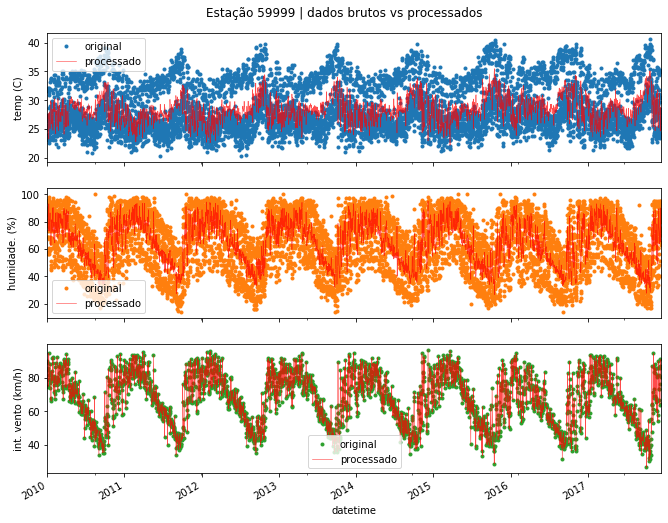


    <Figure size 432x288 with 0 Axes>


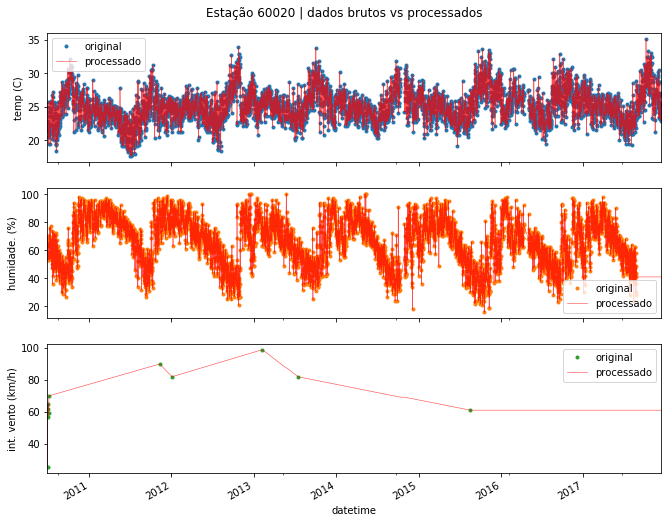


    <Figure size 432x288 with 0 Axes>


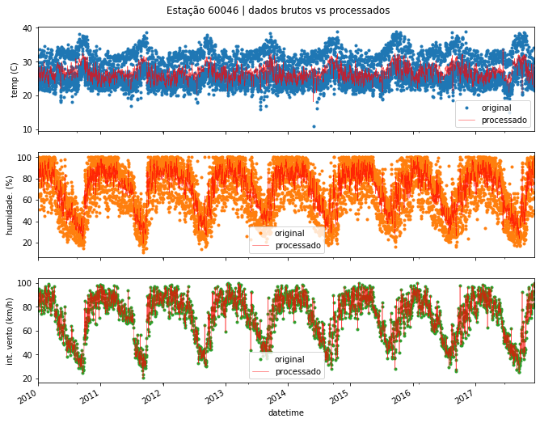


```python

```


# Question 1

Create a restAPIs (using python tornado) in order to provide the weather date inside of grid_weather.csv and grid_weather_data.csv. Create and use any kind of database to make a CRUD (python tornado) to use it later.


```python
# commands in order to start and run both restAPIs.

###############################################################
#abra o terminal, va para o diretório raiz (teste_gaivota) 
# e execute: python api.py

#servidor rodando na porta 8889

#se tiver problema com o banco de dados, basta apagar 
# o arquivo teste_gaivota_data.db e reiniciar a api (python api.py)
################################################################

import requests
import datetime
import json

#post gridweather para data-server
csv_station = pds.read_csv('grid_weather.csv')
csv_station.drop(columns=['Unnamed: 0'], inplace=True)

headers = {'Content-type': 'application/json', 'Accept': 'text/plain'}

url = "http://localhost:8889/stations"
data = {'data': csv_station.to_dict(orient='records')}
r = requests.post(url, data=json.dumps(data), headers=headers)
print(r)

data=json.dumps(data)

#post dados processados gridweatherdata para data-server
def convert_timestamp(x):
    if isinstance(x, (datetime.date, datetime.datetime)):
        return x.isoformat()

#station1
url = "http://localhost:8889/stations/{}/data".format(new_station1['station_id'][0])
data = {'data': new_station1.to_dict(orient='records')}
r = requests.post(url, data=json.dumps(data, default=convert_timestamp), headers=headers)
print(r)

#station2
url = "http://localhost:8889/stations/{}/data".format(new_station2['station_id'][0])
data = {'data': new_station2.to_dict(orient='records')}
r = requests.post(url, data=json.dumps(data, default=convert_timestamp), headers=headers)
print(r)

#station3
url = "http://localhost:8889/stations/{}/data".format(new_station3['station_id'][0])
data = {'data': new_station3.to_dict(orient='records')}
r = requests.post(url, data=json.dumps(data, default=convert_timestamp), headers=headers)
print(r)
```

    <Response [201]>
    <Response [201]>
    <Response [201]>
    <Response [201]>


## Modelo basico da API


- GridWeather (stations info)

  * GET     8889:/stations              
    - retorna lista de todas as estações meteorológicas
  * GET     8889:/stations/id           
    - retorna uma estação meteorológica (id)
  * POST    8889:/stations              
    - pode enviar um único elemento ou uma lista de elementos de estações para serem adicionadas 
  * PUT     8889:/stations/id           
    - atualiza dados da estacao (id)
  * DELETE  8889:/stations/id            
    - delete estação (id)


- GridWeatherData (stations data)

  * GET     8889:/stations/id/data            
    - retorna lista de todos as medições da estação (id)
  * GET     8889:/stations/id/data/id2        
    - retorna uma medição (id2) da estação meteorológica (id)
  * POST    8889:/stations/id/data            
    - pode enviar uma única medição ou uma lista de medições da estação (id) para serem adicionadas 
  * PUT     8889:/stations/id/data/id2        
    - atualiza a medição (id2) da estação (id)
  * DELETE  8889:/stations/id/data/id2        
    - deleta a medição (id2) da estação (id)

# Question 2

Create time-series plots using python with the same data of previous question.


```python
#lendo os dados do data-server

#stations info
url = "http://localhost:8889/stations"
r = requests.get(url)
print(r.status_code)
stations = r.json()['data']

url = "http://localhost:8889/stations/59999/data"
r = requests.get(url)
print(r.status_code)
station1_data = r.json()['data']
station1_data =  pds.DataFrame(station1_data)

url = "http://localhost:8889/stations/60020/data"
r = requests.get(url)
print(r.status_code)
station2_data = r.json()['data']
station2_data =  pds.DataFrame(station2_data)

url = "http://localhost:8889/stations/60046/data"
r = requests.get(url)
print(r.status_code)
station3_data = r.json()['data']
station3_data =  pds.DataFrame(station3_data)
```

    200
    200
    200
    200


```python
from sklearn.linear_model import LinearRegression
import numpy as np

def get_trend(serie):
    
    x = np.arange(len(serie))
    y = serie.values
    model = LinearRegression()
    model.fit(x[:, np.newaxis], y)
    trend = model.predict(x[:, np.newaxis])
    return trend

def analise_climatologica(serie):
    
    serie_mon = serie.resample("M").mean().fillna(serie.mean())
    #tendencia
    trend = get_trend(serie_mon)
    #sazonalidade
    season =serie_mon.groupby([serie_mon.index.month]).mean()
    season_repeat = season.loc[serie_mon.index.month]
    
    #remocao da tendencia e da sazonalidade do sinal
    ana = pds.DataFrame({'data':serie_mon, 'trend': trend,
                              'season': season_repeat.values},
                             index=pds.DatetimeIndex(serie_mon.index))
    
    ana['anom'] = (ana['data'] - (ana['trend'] - ana['trend'].mean())) - ana['season'] 
    
    return ana

def plot_clima(analysis, title=""):
    
    fig = plt.figure()
    axes = analysis.plot(subplots=True, figsize=(11, 9), legend=False,
                         title=["", "tendência", "sazonalidade", "anomalia"])
    axd_limits=axes[0].get_ylim()
    axes[1].set_ylim(axd_limits)
    axes[2].set_ylim(axd_limits)
    an_lim=axes[3].get_ylim()
    an_max=max(an_lim)
    axes[3].set_ylim((-an_max, an_max))
    axes[3].grid(True)
    r = plt.suptitle(title, y=0.93)

    
temp1 = pds.Series(station1_data['dry_bulb_temperature'].values, 
                      index=pds.DatetimeIndex(station1_data['datetime']))
analysis_temp1 = analise_climatologica(temp1["1990":])
plot_clima(analysis_temp1, "Temperatura (C) na estação 59999")

temp2 = pds.Series(station2_data['dry_bulb_temperature'].values, 
                      index=pds.DatetimeIndex(station2_data['datetime']))
analysis_temp2 = analise_climatologica(temp2["1990":])
plot_clima(analysis_temp2, "Temperatura (C) na estação 60020")

temp3 = pds.Series(station3_data['dry_bulb_temperature'].values, 
                      index=pds.DatetimeIndex(station3_data['datetime']))
analysis_temp3 = analise_climatologica(temp3["1990":])
plot_clima(analysis_temp3, "Temperatura (C) na estação 60046")

```


    <Figure size 432x288 with 0 Axes>


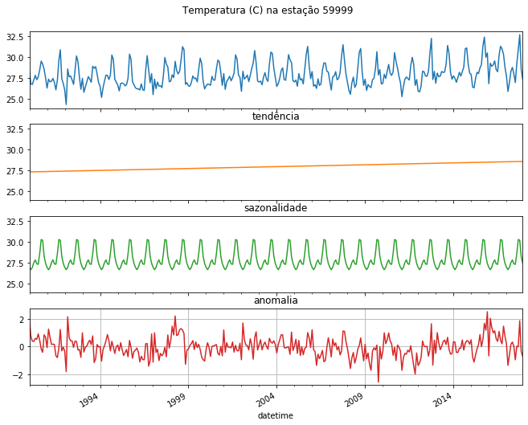


    <Figure size 432x288 with 0 Axes>


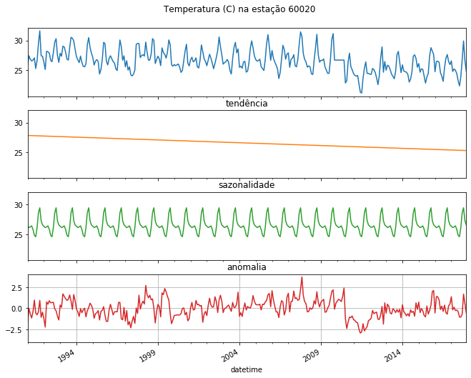


    <Figure size 432x288 with 0 Axes>


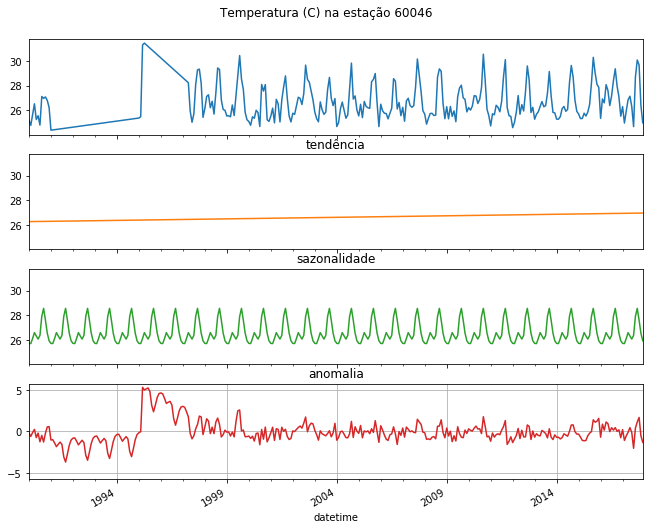


Analise climatológica mostrando as componentes de tendência e sazonalidade. Com a remoção dessas duas componentes, obtemos o sinal de anomalia, ou seja, no caso do clima, o qual sofre grande influência do ciclo solar (anual), o quanto os valores de distanciam do valor do seu mês característico.
<hr>

# Question 3

Create tests in restAPI, it must validate the content and structure (suggestion: pytest).


```python
# 
#  os teste foram feitos com a ferramenta httpie no terminal linux
#  
#  estão no diretorio ./teste_gaivota/json_tests
#
#  para rodar todos os tests, digitar no diretorio: bash run_tests.sh
#  
```

<hr>

# Question 4

Apply a smooth-method in the weather time-series, using question 1. Plot the content using any plot package.


```python
#a funcao faz tres graficos, simulando uma aproximacao/zoom para facilitar a visualizacao do efeito da media movel
def plot_smooth(serie, cut1="", cut2="", yt="", title=""):
    
    if not cut1:
        cut1 = serie.index.year[int(len(serie) - (len(serie)/4))]
    if not cut2:
        cut2 = serie.index.year[int(len(serie) - ((len(serie)/4)/4))]
    
    fig, axes = plt.subplots(3, 1, figsize=(16, 9))
    series = [serie, serie[str(cut1) : str(serie.index.year[-1])], serie[str(cut2) : str(serie.index.year[-1])]]
    
    for s, ax in zip(series,axes):

        serie_daily = s
        #media movel de 7, 30 e 365 dias                        
        serie_7d = serie_daily.rolling(7, center=True).mean()
        serie_30d = serie_daily.rolling(30, center=True).mean()
        serie_365d = serie_daily.rolling(365, center=True).mean()
       
        ax.plot(serie_daily, marker='.', markersize=2, color='0.6',lw=0.6, label='Diário')
        ax.plot(serie_7d, linewidth=1.4, label='Média móvel 7 dias')
        ax.plot(serie_30d, linewidth=2.2, label='Média móvel 30 dias')
        ax.plot(serie_365d, color='0.2', linewidth=3, label='Média móvel 365 dias')
        
        ax.legend()
        ax.set_ylabel(yt)
    
    axes[0].axvspan(str(cut1), str(serie.index.date[-1]), color=sns.xkcd_rgb['yellow'], alpha=0.3)
    axes[1].axvspan(str(cut2), str(serie.index.date[-1]), color=sns.xkcd_rgb['yellow'], alpha=0.3)
    
    fig.suptitle(title)
    return

plot_smooth(temp1, yt='Temperatura (C)', title='Tendências da temperatura (Estação 59999)')
plot_smooth(temp2, yt='Temperatura (C)', title='Tendências da temperatura (Estação 60020)')
plot_smooth(temp3, yt='Temperatura (C)', title='Tendências da temperatura (Estação 60046)')
```


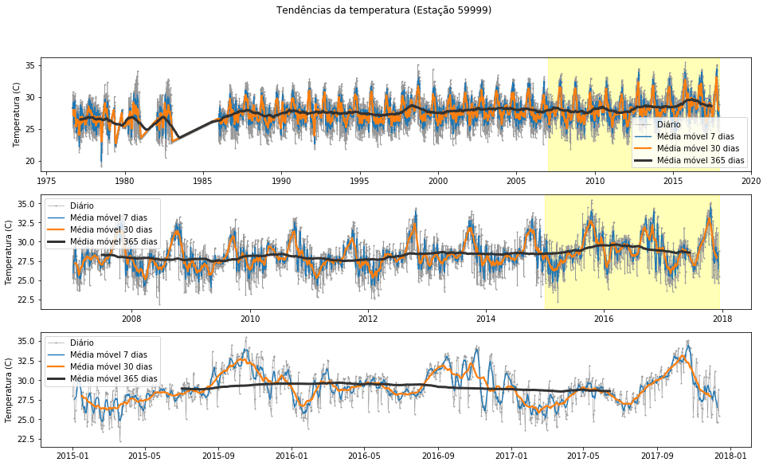


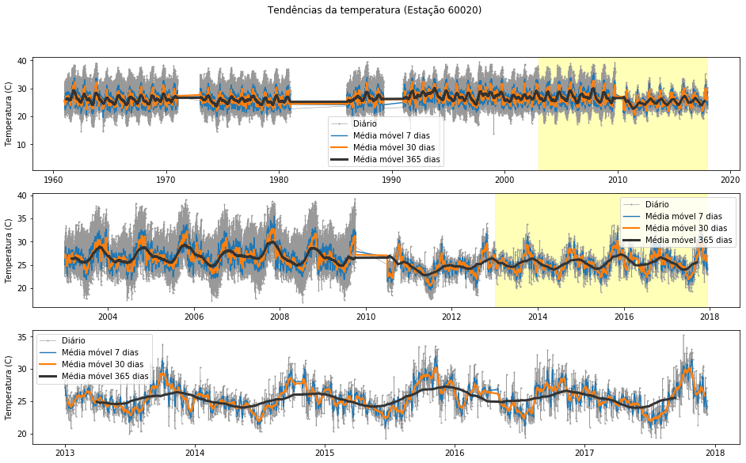


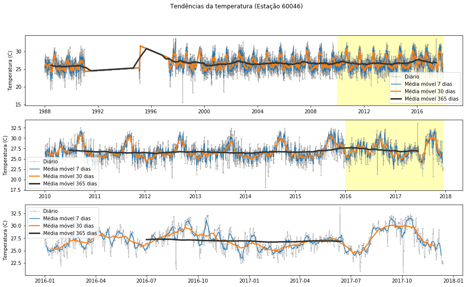


```python

```

<hr>

# Question 5

Make a python script in order to make many requests in parallel in the restAPI that you've created in question 1.


```python
from random import choices, randrange as rd
from multiprocessing import Pool as ThreadPool

#gera urls validas (id de estacao e dos dados) para testar
def generate_valid_requests(num=100):
    url = "http://localhost:8889/stations/{}/data/{}"
    possibilites = [(59999, rd(1, 15080)),(60020, rd(15080, 63608)),(60046, rd(63608, 74547))]
    x = choices(possibilites, k=num)
    #cada url vai com o seu numero de geracao, funcionando como um contador (id, url)
    return [{'id':i, 'url' :url.format(j[0], j[1])} for i, j in enumerate(x)]

#funcao para ser colocada no pool
def get_request(url):
    r = requests.get(url['url'], timeout=10)
    return (url['id'], url['url'], r)

def get_requests(urls, threads=5):
    pool = ThreadPool(threads)
    #mapeamento do pool com a função-tarefa
    results = pool.map(get_request, urls)
    pool.close()
    pool.join()
    return results

def make_requests(num_requests, threads):
    urls = generate_valid_requests(num_requests)
    responses = get_requests(urls, threads)
    for n in responses:
        print(n)
        
    sucesses = sum([1 for i in responses if i[2].status_code == 200])
    print("{} requests feitos, {} respostas SUCESSO (200)".format(len(responses), sucesses))
    return
    

#quantidade de threads
threads=8
#numeros de requests a serem realizados
num_requests=10000

make_requests(num_requests, threads)


        
```

<hr>

# Question 6 - bonus

Using the weekly shape of the weather time series, show how it is possible to aggregate them using any kind of model. Make some statistical analysis of results.


```python
# commands in order to run the project.
```

<hr>
